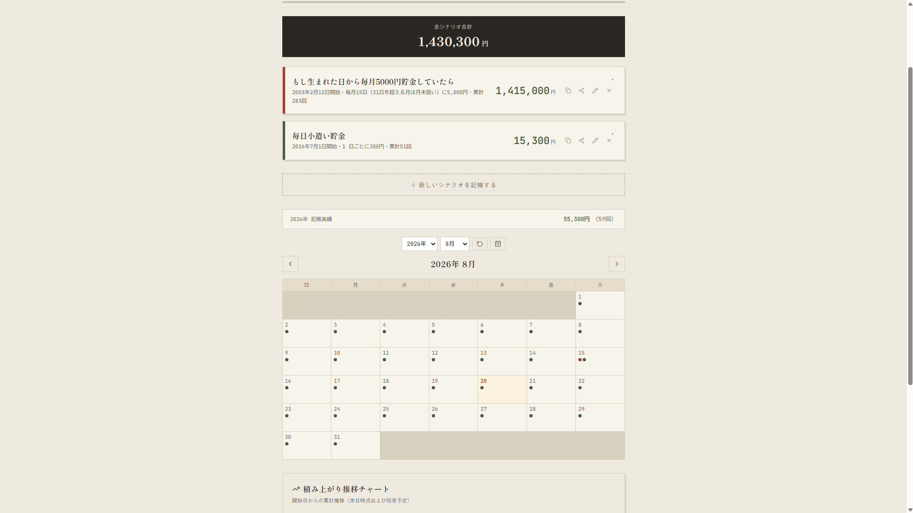

# 積んでたら台帳 / Continuity Ledger

「指定した金額を指定した間隔で貯め続けていたら、今頃いくらになっていたか」を淡々と表示するだけのカレンダーアプリ / A retrospective calendar app that calculates how much money you would have accumulated today had you consistently saved a fixed amount at a regular interval.

[日本語](#日本語) | [English](#english)

---

## 日本語

### これは何をするアプリか

「もしあの日から、指定した金額を指定した間隔で貯金し続けていたら」という仮定のもと、今日時点での到達額をカレンダー上に表示するだけのアプリです。

目標に対する進捗や達成度を煽る要素は一切ありません。実際に貯金したかどうかとは無関係に、「継続していたと仮定した場合の事実」をただ淡々と積み上げて見せることだけを目的としています。複数の仮定（シナリオ）を並べて登録できるので、「もし1月から始めていたら」と「もし今月から始めていたら」を並べて眺める、といった使い方ができます。

臨時収入などの単発の入金を割り込みとして記録したり、後から金額や間隔を編集したりもできます。年間を通じた記帳の推移は、月ごとのカレンダーに加えて12ヶ月分のミニカレンダーでも一望できます。

### 主な機能

- **シナリオ管理**:
  - 開始日、金額、間隔（n日ごと、毎月指定日、毎月末日）、通貨の設定
  - 複数シナリオの同時比較、通貨別の合計表示
  - 既存シナリオの複製
  - 色タグの設定（プリセット色、カスタム色の追加・削除）
- **試算・可視化**:
  - 目標金額を設定した場合の到達予定日の試算
  - 月間カレンダー、12ヶ月ミニカレンダーの表示
  - HTML5 Canvasによる積み上がり推移チャートの表示
- **データ連携・共有**:
  - 任意の日付への割り込み入金の記録
  - CSV書き出し
  - JSON書き出し・読み込み（バックアップ・復元）
  - URLパラメータによるシナリオ単体の共有
- **通知機能**:
  - 入金日のブラウザ通知（画面を開いている間のみ）

### 対応言語

ブラウザの言語設定またはURLパラメータ（例: `?lang=ja` など）で自動的に切り替わります。

- 日本語 (`ja`)
- 英語 (`en`)
- 韓国語 (`ko`)

### 技術的な特徴

- 金額の計算はすべて固定小数点のBigIntで行っており、JavaScriptの`Number`型に起因する桁あふれや丸め誤差は発生しません。
- データは端末のlocalStorageにのみ保存され、外部サーバーへの送信は行いません。
- フレームワークを使用しない素のHTML・CSS・JavaScript（ES Modules分割構成）で構成されています。

### LICENSE

Third-Party → [NOTICE.md](./NOTICE.md)

---

## English

### What this app does

This app shows, on a calendar, how much money you would have today under the assumption that you had kept saving a fixed amount at a fixed interval since a given date.

It contains no elements that push you toward a goal or celebrate progress. Regardless of whether you actually saved anything, it simply states, as a fact, what the running total would be under that assumption. You can register several such assumptions (scenarios) side by side, making it easy to compare, for example, "if I had started in January" against "if I start this month."

You can also record one-off deposits, such as windfalls, as interruptions to a scenario, and edit the amount or interval later. Beyond the monthly calendar, a 12-month mini-calendar view lets you see the whole year's pattern of deposit days at a glance.

### Key Features

- **Scenario Management**:
  - Set start date, amount, interval (every n days, fixed day of month, last day of month), currency
  - Compare multiple scenarios, view totals by currency
  - Duplicate existing scenarios
  - Color tags (preset colors, adding and deleting custom colors)
- **Estimation & Visualization**:
  - Target amount reach date estimation
  - Monthly calendar and 12-month mini-calendar views
  - HTML5 Canvas accumulation trend chart
- **Data & Sharing**:
  - Record ad-hoc deposits on any date
  - CSV export
  - JSON export/import (backup and restore)
  - Share a single scenario via URL parameters
- **Notifications**:
  - Browser notifications on deposit days (only while the page is open)

### Supported Languages

Automatically switches based on browser language settings or the URL parameter (e.g. `?lang=ja`).

- Japanese (`ja`)
- English (`en`)
- Korean (`ko`)

### Technical Notes

- All monetary calculations use fixed-point arithmetic on `BigInt`, avoiding overflow and rounding errors from JavaScript's `Number` type.
- All data is stored only in the browser's `localStorage`; nothing is sent to external servers.
- Built with plain HTML, CSS, and JavaScript (modularized with ES Modules) without frameworks.

### LICENSE

Third-Party → [NOTICE.md](./NOTICE.md)
